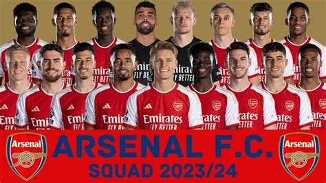

+++
date = '2025-08-26T08:42:38+02:00'
draft = false
title = 'Arsenal'
featured_image = 'thumb.jpg'
+++

## Arsenal  aka The Gunners

Arsenal Football Club **the gunners** is a professional football team based in Islington, North London, England, founded in 1886. Known as "The Gunners," they compete in the Premier League and have won numerous titles, including 13 league championships and a record 14 FA Cups, making them one of the most successful clubs in English football history.

Visit the [Hugo](https://gohugo.io) website!